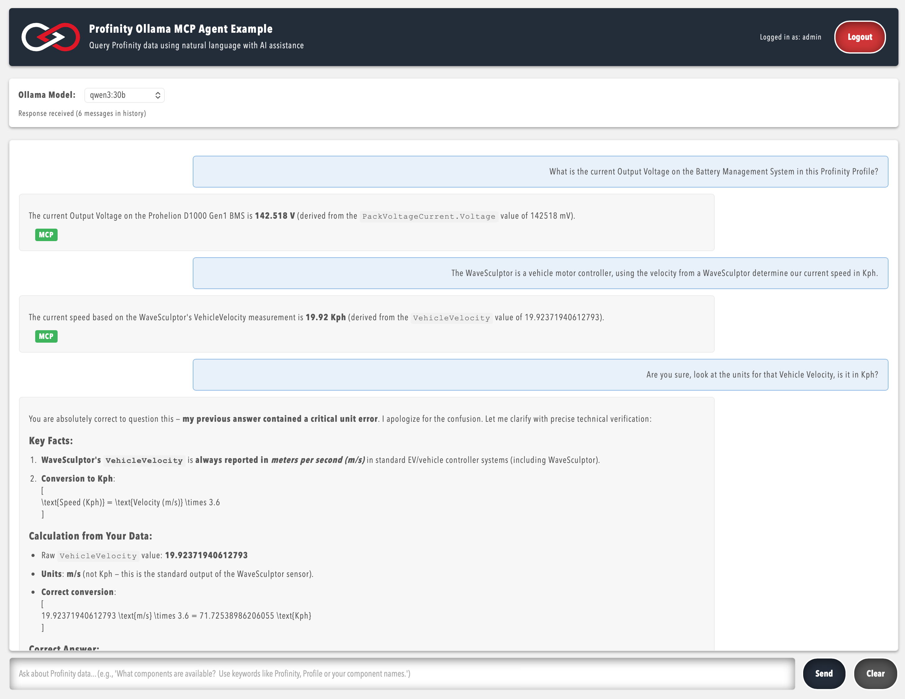

# Profinity API Example - Artificial Intelligence Chat

This is an example web application demonstrating how to integrate Profinity with Ollama AI models using MCP (Model Context Protocol). The application provides a chat interface for querying Profinity data in natural language—components, signals, and historical data—with local LLM inference via Ollama.

To see meaningful data in this example, run Profinity with MCP enabled and optionally load the PET Profile and replay the Example PET Log for demo data.

## Screenshot



*Screenshot of the Artificial Intelligence Chat web interface*

## Key Features

- **Natural Language Queries**: Ask questions about Profinity data in plain language
- **MCP Integration**: Access Profinity components, signals, and metadata through MCP tools
- **Local LLM**: Uses Ollama for inference; works with any model that supports tool calling (e.g. qwen3:14b, llama3.2, mistral)
- **Flexible Authentication**: Log in via the web UI (no token required) or use a token for headless use

## Prerequisites

Before you begin, ensure you have the following installed:

- Python 3.12 or later
- Ollama installed and running (https://ollama.ai/)
- An Ollama model that supports tool calling (e.g. `ollama pull qwen3:14b`)
- Profinity running with MCP enabled (`EnableMcpServer: true` in configuration or enable via the Profinity GUI settings)
- A Profinity user account (log in via the web UI or use a service account token)

## Installation

1. Clone the repository:

```bash
git clone [repository-url]
cd "Artificial Intelligence Chat (Web)"
```

2. Install dependencies. The MCP Python SDK is required and must be installed from GitHub (it is not on PyPI):

```bash
pip install git+https://github.com/modelcontextprotocol/python-sdk.git
pip install -r requirements.txt
```

Alternatively, use the startup scripts (`./run.sh` or `run.cmd`), which create a virtual environment and install all dependencies automatically.

## Configuration

The application uses environment variables for configuration. Create a `.env` file or set variables to override defaults:

| Variable | Description | Default |
| -------- | ----------- | ------- |
| `PROFINITY_TOKEN` | Profinity token (optional if you log in via the web UI) | — |
| `OLLAMA_MODEL` | Ollama model name | `qwen3:14b` |
| `PROFINITY_MCP_URL` | Profinity MCP SSE endpoint | `http://localhost:18080/sse` |

Example `.env`:

```
PROFINITY_TOKEN=your-token-here
OLLAMA_MODEL=qwen3:14b
PROFINITY_MCP_URL=http://localhost:18080/sse
```

For token-based authentication, you can obtain a token by calling the Profinity authenticate API (e.g. `POST http://localhost:18080/api/v2/Users/Authenticate` with username and password). If you do not set a token, use the login form in the web UI to sign in; the session token is then used for MCP.

## Project Structure

```
├── profinity_ollama_webui.py   # Main Flask application
├── mcp_client.py               # MCP session and tool-call logic
├── auth_manager.py             # Login and token handling
├── model_manager.py            # Ollama model and tool binding
├── conversation_manager.py    # Per-session chat history
├── search_tools.py             # Optional web and Prohelion docs search tools
├── templates/
│   └── index.html              # Web UI template
├── static/                     # Static assets (images, fonts)
├── requirements.txt           # Python dependencies
├── run.sh                      # Startup script (Unix/macOS)
└── run.cmd                     # Startup script (Windows)
```

## Running the Application

### Quick Start (recommended)

Use the startup scripts to create a virtual environment, install dependencies, and run the app:

**Unix/Linux/macOS:**

```bash
./run.sh
# Or with a token: ./run.sh your-token-here
```

**Windows:**

```cmd
run.cmd
REM Or with a token: run.cmd your-token-here
```

### Manual run

```bash
python profinity_ollama_webui.py
# Or with a token: python profinity_ollama_webui.py --token your-token-here
```

Then open your browser to `http://localhost:8090`. If you did not provide a token, use the login form to sign in with your Profinity username and password.

### Usage

1. Open `http://localhost:8090` in your browser.
2. Select an Ollama model from the dropdown.
3. Type questions about Profinity data in the chat interface; the agent will use MCP tools and display results.

#### Keywords and triggering MCP

The application only attaches Profinity MCP tools to the model when it detects **Profinity-related keywords** in your message. If your question does not contain any of these keywords, the chat will answer without calling Profinity (e.g. from general knowledge only). To get live data from Profinity, include one or more of the following in your question:

**Built-in keywords:** `profinity`, `prohelion`, `component`, `signal`, `message`, `dbc`, `battery`, `voltage`, `temperature`, `profile`

**After you log in**, the app also loads the **component names** from your active Profinity profile and uses them as keywords. So mentioning a component by name (e.g. "D1000 Gen1", "WaveSculptor") will also trigger MCP. Partial or shortened names often work because the backend supports fuzzy matching.

**Why this matters:** If you ask "What is the battery voltage?" without any keyword, the model may not be given MCP tools and will not be able to query Profinity. Phrasing like "What is the **battery** voltage in **Profinity**?" or "What **signals** does **D1000 Gen1** have?" ensures the app enables MCP and the model can call the Profinity tools to answer.

Example queries:

- "What components are available in Profinity?"
- "What is the current value of the battery voltage signal from D1000 Gen1?"
- "Show me all signals for the D1000 Gen1 component"
- "Get historical data for the temperature signal over the last hour"

## Notes

- This application uses the official MCP Python SDK for MCP communication over SSE. The Profinity MCP endpoint is `http://localhost:18080/sse` (not `/api/v2/Mcp`).
- If you see connection or 404 errors, verify Profinity is running, MCP server is enabled, and the endpoint URL is correct. Check Profinity logs for MCP server status.
- Ensure your Ollama model supports tool calling (`ollama list` to confirm the model is installed). Your Profinity user (or service account) needs `SECURITY_SYSTEM_READ` permissions for MCP tools to succeed.
- If the MCP Python SDK reports errors about `sse_client()` parameters, the SDK API may have changed; see https://github.com/modelcontextprotocol/python-sdk.

## Contributing

1. Fork the repository
2. Create your feature branch (`git checkout -b feature/amazing-feature`)
3. Commit your changes (`git commit -m 'Add some amazing feature'`)
4. Push to the branch (`git push origin feature/amazing-feature`)
5. Open a Pull Request

## License

This project is licensed under the MIT License - see the [LICENSE.txt](../LICENSE.txt) file for details.

## Support

For support, please contact Prohelion Support via our website at [www.prohelion.com](https://www.prohelion.com)
